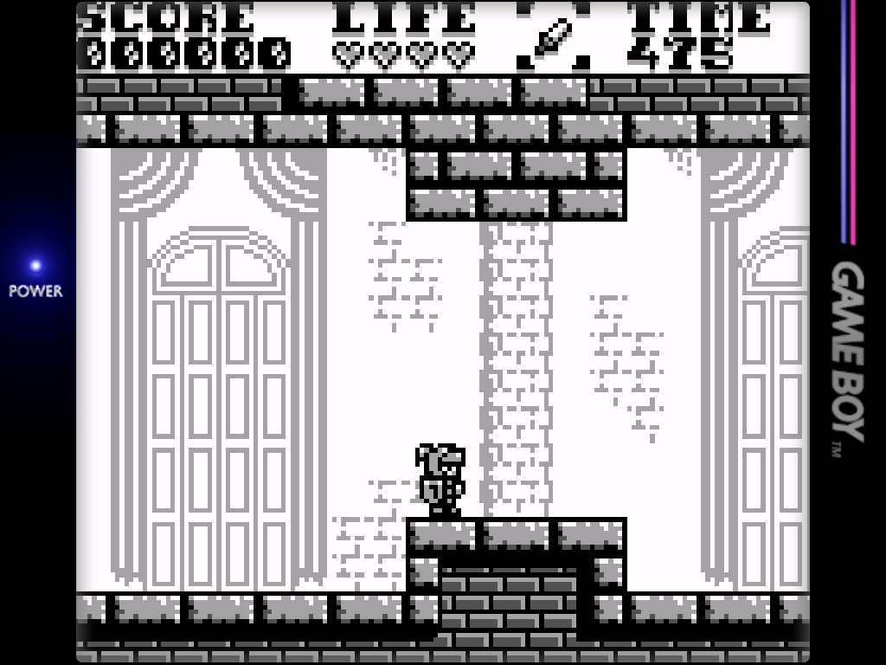
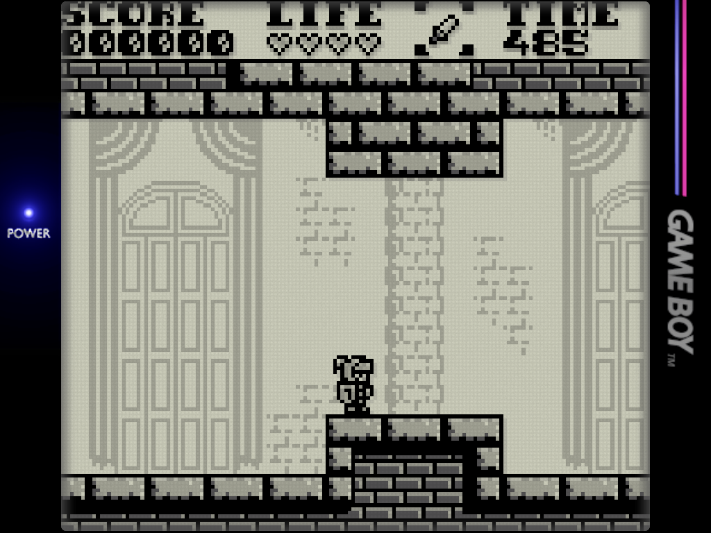
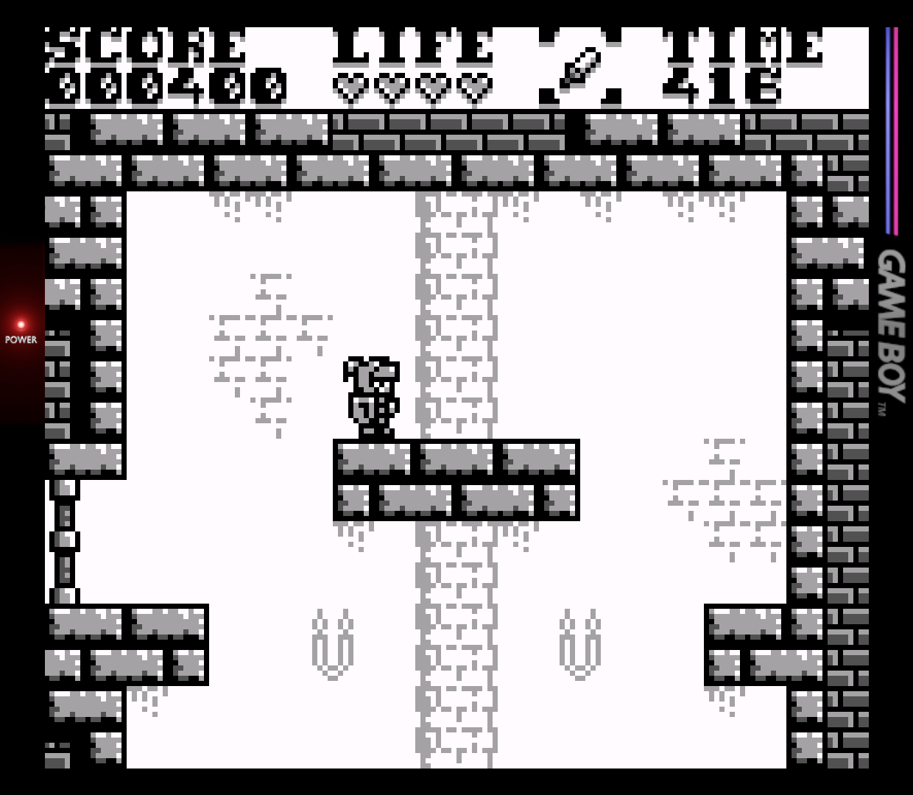
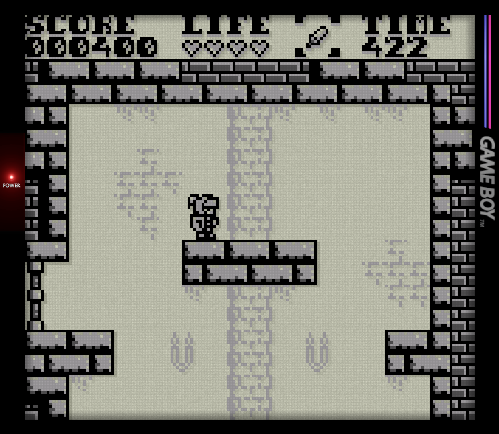

# PT SkyWalker541

### Pixel Transparency Shader for GB · GBC · GBA Emulation

**by SkyWalker541**

---

*On original Game Boy hardware, pixels that were fully off didn't show as white.*
*The physical backing material showed through — a subtle grey-green translucency.*
*Game developers designed around this. Your emulator doesn't know that.*

**PT SkyWalker541 puts the transparency back where it belongs.**

---

## What It Does

Unlit LCD pixels on original GB, GBC, and GBA screens revealed the backing material beneath — a translucent grey-green layer rather than solid white. Developers treated these areas as intentional transparent zones for backgrounds, windows, and UI overlays. On modern emulators they render as flat solid white, losing that layered depth entirely.

This shader detects bright and near-white pixels and blends them toward a procedurally generated backing texture, restoring the original appearance without relying on pre-made assets or additional passes.

Inspired by mattakins' pixel transparency work.

---

## Screenshots

*Black Castle 2 by User0x7f (NextUI Minarch Version)*

| Without Shader | With Shader |
|:---:|:---:|
|  |  |

*Black Castle 2 by User0x7f (RetroArch Version)*

| Without Shader | With Shader |
|:---:|:---:|
|  |  |

---

## v1.6.0 — What Changed

This release is a significant rebuild focused on low-power devices. The Pro variant and Slang builds have been removed. mattakins' shader already covers high-end hardware excellently — this shader exists specifically for devices where cost matters. A single optimised GLSL build serves that purpose better than maintaining multiple variants.

The NextUI variant is now a single file. The previous Aspect/Integer split existed because the sine-wave pixel border behaved differently at different scale modes. The new fract/abs pixel border works correctly at any scale mode, so one file covers both.

---

## Two Variants

| Variant | Platform | Files |
|---|---|---|
| **Standard** | RetroArch (gl / glcore) | `.glsl` + `.glslp` |
| **NextUI** | NextUI / minarch | `.glsl` + `.cfg` |

Both share the same core engine. The NextUI variant has detection thresholds pre-compensated for NextUI's post-processing pipeline and uses a single file for all scale modes.

---

## Why GLSL Only

This shader targets low-power emulation devices — handhelds, SBCs, and budget Android hardware running RetroArch on gl or glcore drivers. Devices capable of running Vulkan or other Slang-compatible backends have no need for this shader — mattakins' version is the better choice there.

---

## Features

- **Pixel transparency restoration** (`PT_PIXEL_MODE`, `PT_BASE_ALPHA`, `PT_WHITE_TRANSPARENCY`) — detects white and near-white pixels and blends them toward a procedurally generated backing texture. Detection runs on the raw pre-correction frame (RetroArch) or the post-processed frame with compensated thresholds (NextUI). Three modes: white-only, brightness-proportional, or all pixels.
- **Procedural backing texture** (`PT_PALETTE`, `PT_PALETTE_INTENSITY`) — noise grain tinted to match the original hardware's backing material. Four palette options: off, Pocket grey (warm green-grey, DMG/Pocket), grey (GBC/GBA Original), white (GBA SP). Adjustable tint intensity.
- **Drop shadow** (`PT_SHADOW_OFFSET`, `PT_SHADOW_OPACITY`) — cast by all solid non-white pixels onto the backing behind them. Appears at all sprite and tile edges regardless of surrounding transparency.
- **Pixel border** (`PT_PIXEL_BORDER`) — continuous strength control simulating the thin physical gap between individual LCD dots. Works correctly at any scale mode.
- **Bezel shadow** (`PT_BEZEL`) — rectangular edge darkening simulating the shadow cast by the physical bezel onto the LCD panel. Width is set automatically per `PT_SYSTEM` based on actual bezel recess depth. Strength is user adjustable.
- **Colour harshness filter** (`PT_DARK_FILTER_LEVEL`) — softens overly vivid dark colours. Most useful for GBC games with aggressive colour palettes.

---

## System Presets

`PT_SYSTEM` selects a pre-tuned white detection threshold for each system's display characteristics.

| PT_SYSTEM | System | RetroArch threshold | NextUI threshold |
|:---:|---|:---:|:---:|
| 0 | Manual — set via PT_SENSITIVITY | — | — |
| 1 | Game Boy / Pocket | 0.90 | 0.62 |
| 2 | Game Boy Color | 0.85 | 0.68 |
| 3 | GBA SP (front-lit) | 0.80 | 0.45 |
| 4 | GBA Original | 0.75 | 0.42 |

NextUI thresholds are lower because detection runs on the post-processed frame rather than the raw pre-correction frame.

---

## Installation

**RetroArch**
1. Place `PT_SkyWalker541.glsl` and `PT_SkyWalker541.glslp` in your RetroArch shaders folder
2. Load the `.glslp` from Quick Menu → Shaders → Load Shader Preset
3. Set `PT_SYSTEM` to match your target system
4. See `README_GLSL.md` for full documentation and per-system settings

**NextUI**
1. Place `PT_SkyWalker541_NextUI.cfg` in your NextUI shaders folder
2. Place `PT_SkyWalker541_NextUI.glsl` in the `glsl` subfolder
3. Load the `.cfg` from the in-game shader menu
4. Set `PT_SYSTEM` to match your target system
5. See `README_NextUI.md` for full documentation and per-system settings

---

## Parameters

| Parameter | Description |
|---|---|
| `PT_SYSTEM` | System preset — sets the white detection threshold |
| `PT_SENSITIVITY` | Manual detection threshold (PT_SYSTEM = 0 only) |
| `PT_PIXEL_MODE` | White only / Bright / All pixels |
| `PT_BASE_ALPHA` | How transparent detected pixels become |
| `PT_WHITE_TRANSPARENCY` | Minimum transparency floor for confirmed white pixels |
| `PT_PALETTE` | Backing tint — Off / Pocket grey / Grey / White |
| `PT_PALETTE_INTENSITY` | Tint strength |
| `PT_DARK_FILTER_LEVEL` | Softens overly vivid dark colours (0 = off) |
| `PT_PIXEL_BORDER` | LCD dot gap strength (0 = off, continuous) |
| `PT_SHADOW_OFFSET` | Drop shadow distance — X and Y together |
| `PT_SHADOW_OPACITY` | Drop shadow strength (0 = off) |
| `PT_BEZEL` | Bezel shadow strength (0 = off) |

---

*PT SkyWalker541 by SkyWalker541 | v1.6.0*

